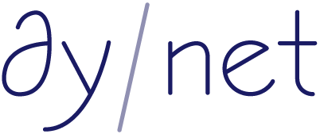

    

---

The Dynamic Neural Network Toolkit

**News!** The master branch is now DyNet version 2.0 (as of 6/28/2017), which contains a number of changes including a new model format, etc. If you're looking for the old version, check out the [v1.1 branch](https://github.com/clab/dynet/tree/v1.1).

- [General](#general)
- [Installation](#installation)
  - [C++](#c-installation)
  - [Python](#python-installation)
- [Getting Started](#getting-started)
- [Citing](#citing)
- [Releases and Contributing](#releases-and-contributing)

## General

DyNet is a neural network library developed by Carnegie Mellon University and many others. It is written in C++ (with bindings in Python) and is designed to be efficient when run on either CPU or GPU, and to work well with networks that have dynamic structures that change for every training instance. For example, these kinds of networks are particularly important in natural language processing tasks, and DyNet has been used to build state-of-the-art systems for [syntactic parsing](https://github.com/clab/lstm-parser), [machine translation](https://github.com/neubig/lamtram), [morphological inflection](https://github.com/mfaruqui/morph-trans), and many other application areas.

Read the [documentation](http://dynet.readthedocs.io/en/latest/) to get started, and feel free to contact the [dynet-users group](https://groups.google.com/forum/#!forum/dynet-users) group with any questions (if you want to receive email make sure to select "all email" when you sign up). We greatly appreciate any bug reports and contributions, which can be made by filing an issue or making a pull request through the [github page](http://github.com/clab/dynet).

You can also read more technical details in our [technical report](https://arxiv.org/abs/1701.03980).

## Getting started

You can find tutorials about using DyNet [here (C++)](http://dynet.readthedocs.io/en/latest/tutorial.html#c-tutorial) and [here (python)](http://dynet.readthedocs.io/en/latest/tutorial.html#python-tutorial), and [here (EMNLP 2016 tutorial)](https://github.com/clab/dynet_tutorial_examples).

One aspect that sets DyNet apart from other tookits is the **auto-batching** feature. See the [documentation](http://dynet.readthedocs.io/en/latest/minibatch.html) about batching.

The `example` folder contains a variety of examples in C++ and python.

## Installation

DyNet relies on a number of external programs/libraries including CMake,
Eigen, and Mercurial (to install Eigen). CMake, and Mercurial can
be installed from standard repositories.

For example on **Ubuntu Linux**:

    sudo apt-get install build-essential cmake mercurial

Or on **macOS**, first make sure the Apple Command Line Tools are installed, then
get CMake, and Mercurial with either homebrew or macports:

    xcode-select --install
    brew install cmake hg  # Using homebrew.
    sudo port install cmake mercurial # Using macports.

On **Windows**, see [documentation](http://dynet.readthedocs.io/en/latest/install.html#windows-support).

To compile DyNet you also need the [development version of the Eigen
library](https://bitbucket.org/eigen/eigen). **If you use any of the
released versions, you may get assertion failures or compile errors.**
If you don't have Eigen already, you can get it easily using the
following command:

    hg clone https://bitbucket.org/eigen/eigen/ -r 2355b22

The `-r NUM` specified a revision number that is known to work.  Adventurous
users can remove it and use the very latest version, at the risk of the code
breaking / not compiling. On macOS, you can install the latest development
of Eigen using Homebrew:

    brew install --HEAD eigen

### C++ installation

You can install dynet for C++ with the following commands

    # Clone the github repository
    git clone https://github.com/clab/dynet.git
    cd dynet
    # Checkout the latest release
    git checkout tags/v2.0
    mkdir build
    cd build
    # Run CMake
    # -DENABLE_BOOST=ON in combination with -DENABLE_CPP_EXAMPLES=ON also
    # compiles the multiprocessing c++ examples
    cmake .. -DEIGEN3_INCLUDE_DIR=/path/to/eigen -DENABLE_CPP_EXAMPLES=ON
    # Compile using 2 processes
    make -j 2
    # Test with an example
    ./examples/train_xor

For more details refer to the [documentation](http://dynet.readthedocs.io/en/latest/install.html#building)

### Python installation

You can install DyNet for python by using the following command

    pip install git+https://github.com/clab/dynet#egg=dynet

For more details refer to the [documentation](http://dynet.readthedocs.io/en/latest/python.html#installing-dynet-for-python)

## Citing

If you use DyNet for research, please cite this report as follows:

    @article{dynet,
      title={DyNet: The Dynamic Neural Network Toolkit},
      author={Graham Neubig and Chris Dyer and Yoav Goldberg and Austin Matthews and Waleed Ammar and Antonios Anastasopoulos and Miguel Ballesteros and David Chiang and Daniel Clothiaux and Trevor Cohn and Kevin Duh and Manaal Faruqui and Cynthia Gan and Dan Garrette and Yangfeng Ji and Lingpeng Kong and Adhiguna Kuncoro and Gaurav Kumar and Chaitanya Malaviya and Paul Michel and Yusuke Oda and Matthew Richardson and Naomi Saphra and Swabha Swayamdipta and Pengcheng Yin},
      journal={arXiv preprint arXiv:1701.03980},
      year={2017}
    }

## Releases and Contributing

The current release of DyNet is [v2.0](https://github.com/clab/dynet/releases/tag/v2.0).

We welcome any contribution to DyNet! You can find the contributing guidelines [here](http://dynet.readthedocs.io/en/latest/contributing.html)
