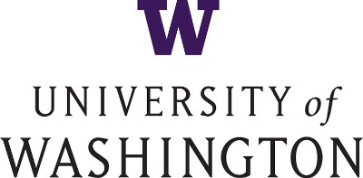

Contributors
============

DyNet was started at `Carnegie Mellon University <http://www.cmu.edu>`_ by Chris Dyer (now at `DeepMind <https://deepmind.com>`_), and the project is now led by Graham Neubig (`CMU <http://www.cmu.edu>`_) and Yoav Goldberg (`Bar Ilan University <https://www1.biu.ac.il/indexE.php>`_).
It relies `contributors <https://github.com/clab/dynet/graphs/contributors>`_ from a wide variety of institutions, including:

and many others!
