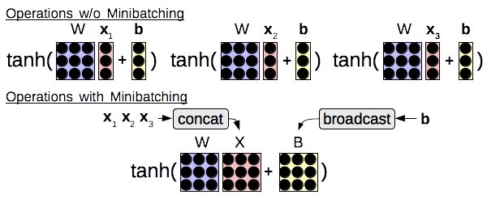
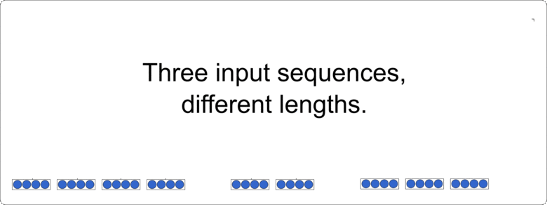

.. _minibatching:

Minibatching
============

Minibatching Overview
---------------------

Minibatching takes multiple training examples and groups them together to be processed simultaneously, often allowing for large gains in computational efficiency due to the fact that modern hardware (particularly GPUs, but also CPUs) have very efficient vector processing instructions that can be exploited with appropriately structured inputs.
As shown in the figure below, common examples of this in neural networks include grouping together matrix-vector multiplies from multiple examples into a single matrix-matrix multiply, or performing an element-wise operation (such as ``tanh``) over multiple vectors at the same time as opposed to processing single vectors individually.

In most neural network toolkits, mini-batching is largely left to the user, with a bit of help from the toolkit.
This is usually done by adding an additional dimension to the tensor that they are interested in processing, and ensuring that all operations consider this dimension when performing processing.
This adds some cognitive load, as the user must keep track of this extra batch dimension in all their calculations, and also ensure that they use the correct ordering of the batch dimensions to achieve maximum computational efficiency.
Users must also be careful when performing operations that combine batched and unbatched elements (such as batched hidden states of a neural network and unbatched parameter matrices or vectors), in which case they must concatenate vectors into batches, or "broadcast" the unbatched element, duplicating it along the batch dimension to ensure that there are no illegal dimension mismatches.

DyNet hides most of this complexity from the user through easy-to-use mini-batching functionality that can either be completely automatic, or

Automatic Mini-batching
-----------------------

If you want to get many of the benefits of mini-batching without doing any work, you can use DyNet's automatic mini-batching functionality.

This functionality can be enabled by enabling the ``--dynet-autobatch 1`` command line option, and if this is enabled, DyNet will automatically attempt to find operations that can be batched together to improve efficiency.
To take full advantage of this, you will want to create a big computation graph that represents multiple training examples by simply iterating over the multiple training examples as follows:

.. code-block:: python

  for minibatch in training_data:
    dy.renew_cg()
    losses = []
    for x, y in minibatch:
      l = calculate_my_loss(x, y)
      losses.append(l)
    loss = dy.esum(losses)
    loss.forward()
    loss.backward()
    trainer.update()

This is nice because the `calculate_my_loss` function can be arbitrarily complex and doesn't have to have the same structure across sentences.
A full example of mini-batching in action for a tree-structured neural network model can be found here for `C++ <https://github.com/neulab/dynet-benchmark/blob/master/dynet-cpp/treenn-bulk.cc>`_ and `Python <https://github.com/neulab/dynet-benchmark/blob/master/dynet-py/treenn-bulk.py>`_.

Manual Mini-batching
--------------------

In easy-to-minibatch networks where the structure remains the same across multiple sentences, it is possible to get some further gains by performing manual mini-batching, similarly to what you do in other toolkits.
Even in this case, DyNet hides much of this complexity from the user through the use of specially designed batching operations which treat the number of mini-batch elements not as another standard dimension, but as a special dimension with particular semantics.
Broadcasting is done behind the scenes by each operation implemented in DyNet, and thus the user must only think about inputting multiple pieces of data for each batch, and calculating losses using multiple labels.

First, let's take a look at a non-minibatched example using the Python API.
In this example, we look up word embeddings ``word_1`` and ``word_2`` using lookup parameters ``E``.
We then perform an affine transform using weights ``W`` and bias ``b``, and perform a softmax.
Finally, we calculate the loss given the true label ``out_label``.

.. code-block:: python

  # in_words is a tuple (word_1, word_2)
  # out_label is an output label
  word_1 = E[in_words[0]]
  word_2 = E[in_words[1]]
  scores_sym = W*dy.concatenate([word_1, word_2])+b
  loss_sym = dy.pickneglogsoftmax(scores_sym, out_label)

Next, let's take a look at the mini-batched version:

.. code-block:: python

  # in_words is a list [(word_{1,1}, word_{1,2}), (word_{2,1}, word_{2,2}), ...]
  # out_labels is a list of output labels [label_1, label_2, ...]
  word_1_batch = dy.lookup_batch(E, [x[0] for x in in_words])
  word_2_batch = dy.lookup_batch(E, [x[1] for x in in_words])
  scores_sym = W*dy.concatenate([word_1_batch, word_2_batch])+b
  loss_sym = dy.sum_batches( dy.pickneglogsoftmax_batch(scores_sym, out_labels) )

We can see there are only 4 major changes: the word IDs need to be transformed into lists of IDs instead of a single ID, we need to call ``lookup_batch`` instead of the standard lookup, we need to call ``pickneglogsoftmax_batch`` instead of the unbatched version, and we need to call ``sum_batches`` at the end to sum the loss from all the batches.

A full example of mini-batching in action for a recurrent neural language model can be found here for `C++ <https://github.com/neulab/dynet-benchmark/blob/master/dynet-cpp/rnnlm-batch.cc>`_ and `Python <https://github.com/neulab/dynet-benchmark/blob/master/dynet-py/rnnlm-batch.py>`_.

The Mini-batch Dimension
------------------------

The way DyNet handles this is by using a special privileged "mini-batch element" dimension, which indicates the number of training examples in the mini-batch. To give an example from the C++ API, we can declare a ``Dim`` object in C++

.. code-block:: c++

  Dim d({2,4,8}, 16)

or Python

.. code-block:: python

  d = Dim([2,4,8], 16)

Here, ``2,4,8`` are the dimensions of the data in the tensor for each example, while ``16`` is the number of examples in the mini-batch. When we print out the dimensions (for example when calling the ``print_graphviz()`` functionality for debugging, this will be print as ``{2,4,8x16}``.

Mini-batched Functions
----------------------

For the great majority of standard operations, things should work seamlessly for minibatched elements. The one condition is that all inputs must have either one mini-batch element only, or the same number of mini-batch elements. So a binary function ``f(x,y)`` could take inputs where the number of minibatch elements in ``x/y`` are ``1/1``, ``4/1``, ``1/4``, or ``4/4`` respectively. However, it is not possible to have different non-one numbers of minibatch elements, such as ``x/y`` having minibatch sizes of ``2/4``.

There are some operations where we need to explicitly think about batching, mostly on the input and output sides of the graph. These include input operations:

* ``lookup()`` (C++) and ``lookup_batch()`` (Python): Performs lookup over a vector of input IDs, where each input ID is an element of the mini-batch.
* ``input()``: C++ input can specify a ``Dim`` object that is mini-batched. In Python, directly adding batched input is not supported yet, but there is a _`workaround <https://github.com/clab/dynet/issues/175>` using ``reshape()``.

Loss calculation operations:

* ``pickneglogsoftmax()`` (C++) and ``pickneglogsoftmax_batch()`` (Python): Calculates the negative log softmax loss over multiple batch elements.
* ``hinge()`` (C++): Similarly, calculate hinge loss over multiple elements.

Manipulation operations:

* ``reshape()``: Can be used to reshape into tensors with a batch element of more than one.
* ``pick()`` (C++) and ``pick_batch()`` (Python): Picks an element for each of the mini-batch elements.
* ``sum_batches()``: Will sum together all of the values in the batch. This is often used to sum together the loss function befor performing the backward step.
