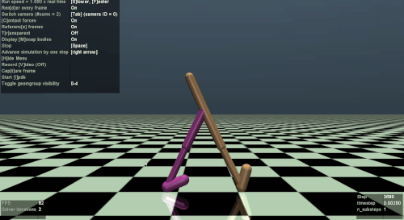
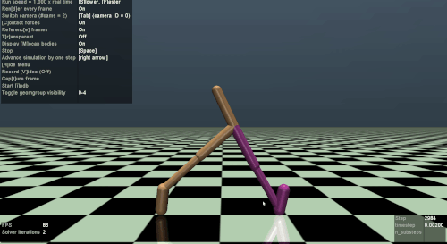
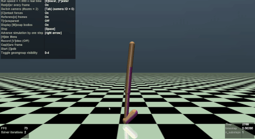

# Reinforcement Learning using DyNet
We provide DyNet example implementations of two commonly-adopted reinforcement learning (RL) algorithms 
* [Deep Q-Network (DQN)](https://arxiv.org/abs/1312.5602)
* [Deep Deterministic Policy Gradient (DDPG)](https://arxiv.org/abs/1509.02971)

In order to obtain good training performance, we also (optionally) incorporate some de facto techniques for RL, including [Double Q-Learning](https://arxiv.org/abs/1509.06461), [Prioritized Replay](https://arxiv.org/abs/1511.05952) and [Dueling Network Architectures](https://arxiv.org/abs/1511.06581).

## Requirements
* Python (>= 3.5)
* [DyNet (Python)](http://dynet.readthedocs.io/en/latest/python.html#manual-installation)
* [OpenAI Gym](https://github.com/openai/gym)

##  Classical Control with Discrete Action Space using DQN
### Run training
```
python main_dqn.py --env_id 0
```
where `env_id` chooses one of the classic control environment from OpenAI Gym, which includes [CartPole](https://gym.openai.com/envs/CartPole-v1/), [MountainCar](https://gym.openai.com/envs/MountainCar-v0/), and [Acrobot](https://gym.openai.com/envs/Acrobot-v1/), all with **discrete action space**.

To enable Double Q-Learning, Prioritized Replay and Dueling Network Architecture, we can add the following tags, respectively:
```
python main_dqn.py --env_id 0 --double --dueling --prioritized
```
### Demo results
  

## Mujoco (Continuous Control) using DDPG:
### Run training
```
python main_ddpg.py
```
### Demo results
  

In the Mujoco game, the action space is **continuous**. The two-leg robot is supposed to be trained not to fall down and to move forward as fast as possible. The above three different strategies learned by the bot are *standing still*, *moving slowly* and *hopping forward*. The corresponding rewards of these strategies in the 'Walker2d-v2' environment is around 1050, 1200 and 1600, respectively, compared to random policies which get 1.7 in average.
